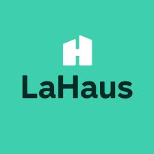
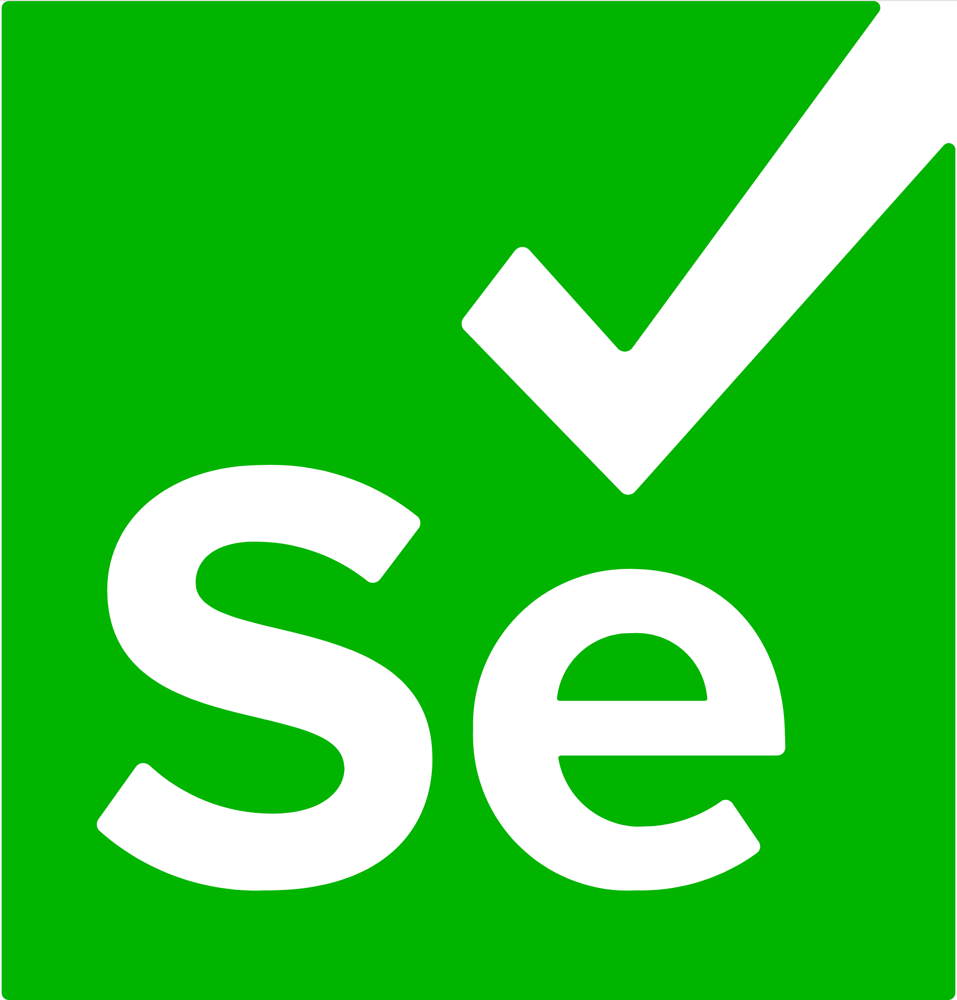

# 

# Prueba automatizada para realizar la consulta de un inmueble y de servicios rest

## Funcionalidades

* Consultar inmueble

## Servicios Rest

* Consultar usuario
* Crear usuario
* Modificar usuario
* Eliminar usuario

# 

## Framework

* Serenity: Se utiliza como framework Serenity BDD, que utiliza los resultados de las pruebas para realizar la documentación describiendo lo que hace la aplicación, informa que pruebas se han realizado, las pruebas que fallaron y las que pasaron. 

## Patron de desarrollo

* Se utiliza Screenplay pattern ya que esta centrado en el usuario y orientado a tareas, utiliza los principios S.O.L.I.D. Con screenplay se puede escribir el codigo en un lenguaje mas natural.

## Herramientas de compilación 

# 

### Gradle

* Es un gestor de proyectos.

# 

### Cucumber

* Es una herramienta que permite escribir los casos de prueba.

# 

### Jenkins

* Es un servidor de integración continua, gratuito, open-source.

# 

### Sonarqube

* Es una plataforma para evaluar código fuente. Es software libre y usa diversas herramientas de análisis estático de código fuente como Checkstyle, PMD o FindBugs para obtener métricas que pueden ayudar a mejorar la calidad del código de un programa.

# 

### Selenium

* Selenium es un entorno de pruebas de software para aplicaciones basadas en la web. Selenium provee una herramienta de grabar/reproducir para crear pruebas sin usar un lenguaje de scripting para pruebas.

# 

### Zalenium

* Es el resultado de mezclar Zalando y Selenium. El objetivo de este proyecto es proporcionar una forma sencilla de crear una cuadrícula y contribuir a la comunidad de Selenium.

## La estructura completa del proyecto es la siguiente:

* Features: Utiliza lenguaje Gherkin y contienen los escenarios de negocio del caso de prueba. 
* Tasks: Clases que representan tareas que realiza el actor a nivel de proceso de negocio. 
* Questions: Comprueban los resultados de las operaciones realizadas.
* Interactions: Indican acciones como dar clic, select, enviar datos, scroll, entre otras cosas.
* Models: Estas clases representan abstracciones de objetos que hacen parte de la aplicación o del negocio.
* Builders: Es un patrón de diseño diseñado para proporcionar una solución flexible a varios problemas de creación de objetos en la programación orientada a objetos.
* Exceptions: Son las excepciones que se visualizan cuando un test falla o tiene errores. 
* Interfaces: Es una clase abstracta que se utiliza para agrupar métodos relacionados con cuerpos vacíos.
* Utils: En este package van las clases que son utilies para la construcción de la automatización, como cambiar formato de fecha, leer archivo, etc.

# Requerimientos

* Java JDK 1.8 
* Gestor de proyectos Gradle 

# Comandos para ejecutar el proyecto.

* gradle clean test aggregate /Este comando ejecuta todo el proyecto.
* gradle clean test aggregate -Ddriver=browser //este comando sirve para ejecutar la prueba en un navegador, se permite firefox y chrome.
* gradle clean test aggregate -Ddriver=remote -Dremote=Browser //este comando sirve para ejecutar la prueba de manera remota, se permite los navegadores firefox y chrome.

# Requerimientos para correr las pruebas en Jenkins

* Se debe tener acceso a sonarqube o sonarcloud y modificar el build.gradle con las credenciales.
* Tener zalenium corriendo

# Zalenium

* docker-compose up - para activar el zalenium.

## Autor

Juan Francisco Builes Montoya - juanfranciscobumo@gmail.com
